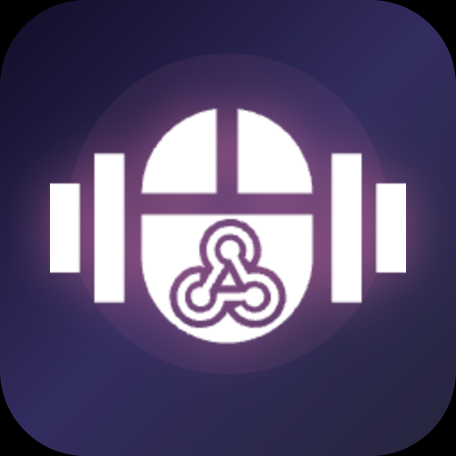

<p align="center">
  
</p>

# HaTTaPtic

HTTP-triggered haptic feedback for Logitech MX Master 4.

Send a curl request, the mouse vibrates.

## Usage

```bash
# Trigger a haptic waveform
curl http://127.0.0.1:18274/haptic/knock

# Wait for the waveform to finish before returning
curl "http://127.0.0.1:18274/haptic/knock?wait=300"

# List available waveforms
curl http://127.0.0.1:18274/waveforms

# Health check
curl http://127.0.0.1:18274/health
```

Concurrent requests with `?wait=` are serialized -- the second haptic waits for the first to finish.

## Available Waveforms

| Waveform | Feel |
|----------|------|
| `sharp_collision` | Sharp, precise click |
| `damp_collision` | Soft collision |
| `subtle_collision` | Very light tap |
| `sharp_state_change` | Clear state confirmation |
| `damp_state_change` | Soft state confirmation |
| `completed` | Completion / success |
| `angry_alert` | Strong warning |
| `happy_alert` | Positive notification |
| `knock` | Simple knock |
| `ringing` | Ringing notification |

## Requirements

- macOS 14+ (Sonoma)
- Logitech MX Master 4
- Logi Options+ installed and running
- Docker (for building locally)

## Build

```bash
./build.sh
```

Requires Docker. The build runs in a container -- no local .NET SDK needed.

## Install

1. Download `HaTTaPtic.lplug4` from [Releases](../../releases) (or build it: `./build.sh`)
2. Install with:
   ```bash
   mkdir -p ~/Library/Application\ Support/Logi/LogiPluginService/Plugins/HaTTaPtic && unzip -o HaTTaPtic.lplug4 -d ~/Library/Application\ Support/Logi/LogiPluginService/Plugins/HaTTaPtic && killall LogiPluginService
   ```

Double-click install only works for Marketplace-signed plugins. HaTTaPtic is not on the Marketplace (yet), so manual install is required.

### Development

During development, `./build.sh` creates a `.link` file that points Logi Plugin Service
to your local build output. Changes are picked up on service restart.

## How It Works

HaTTaPtic is a Logi Options+ plugin. It starts an HTTP server on `127.0.0.1:18274`.
When it receives a GET request to `/haptic/{waveform}`, it triggers the corresponding
haptic pattern on the MX Master 4 via the Logi Options+ Plugin SDK.

```
curl GET /haptic/knock
  -> HaTTaPtic plugin (runs inside Logi Options+)
    -> PluginEvents.RaiseEvent("knock")
      -> Logi Options+ sends haptic waveform to MX Master 4
        -> Mouse vibrates
```

## Updating Logi Options+ Dependencies

After a Logi Options+ update, sync the runtime DLLs:

```bash
./scripts/sync-libs.sh
git add lib/ && git commit -m "chore: sync Logi Options+ runtime DLLs"
```

## License

MIT
